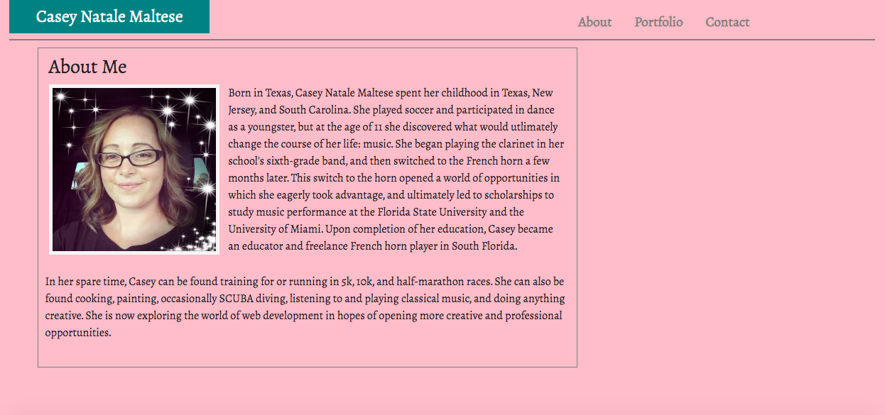
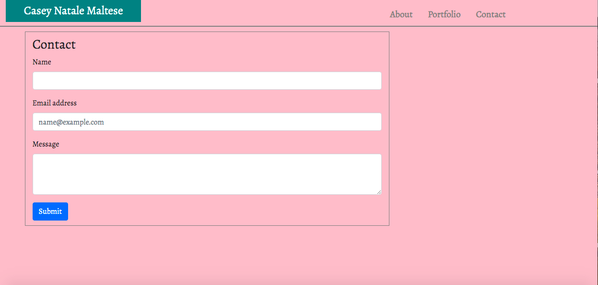

# responsive-portfolio
homework2

This is my repsonsive-portfolio assignment.  I created a contact page, an index page, and a portfolio page using Bootstrap templates. The pages are responsive. Each page consists of a a nav bar and working links.  This assigment also consists of images and a bio.
Deployed: https://caseofbase18.github.io/responsive-portfolio/

